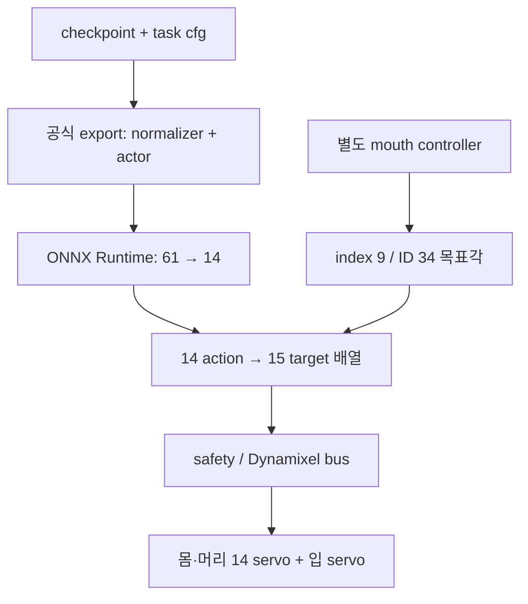

# MicroDuck FetchPick Phase 1 — 하드웨어 구조 검증·설계 판정

조사 기준일: 2026-10-07, Asia/Seoul. 이번 변경은 조사 문서와 CPU 검사 결과뿐이다.

판정: **하드웨어 PARTIALLY VERIFIED / 체크포인트 CONDITIONAL / 장시간 학습 NO-GO**.
관절·actuator·환경·정책·runtime은 구현하거나 변경하지 않았다.

## 조사 범위와 버전

| 자료 | 확인한 버전·범위 |
|---|---|
| `thankfull120/microduck_rl` develop | `273afe0b31c4ab365b9ff806a927b63ac92b5ddd`; 전체 재귀 트리 272개 항목, 253개 파일 전부 Git blob SHA 일치 |
| 공식 `pollen-robotics/microduck_rl` develop | 동일 커밋; 사용자 저장소 README의 upstream 링크와 일치 |
| 공식 `pollen-robotics/microduck` main | `dec725c67ffbbdde7f1de30f8c936b1bf9c1d70e`; 전체 트리 521개 항목, 관련 runtime 파일 42개 SHA 검증 및 추가 의존성/배포 파일 조사 |
| 공식 Hugging Face `pollen-robotics/microduck-simulator` | `023172c8a7d629b5258d90364c13bafe013abbfa`; README, `duck.js`, `game.js`, allcollisions XML 조사 |
| 공식 `pollen-robotics/elec_RPI_Robot_HAT` | `78f60f711f519e8b57c4b1ea937bd2bb8249b1d3`; 전체 파일 목록·README 확인 |
| 공식 `pollen-robotics/rustypot` develop | `5a6d0a0a4ccade6b2e69ae74e09a2c20c2fc6f80`; XL330 register/각도 변환 확인. runtime Cargo는 rustypot `1.8.0`을 요구하므로 이 develop 조사와 설치 binary 검증은 구분 |
| 작업 브랜치·PR | `feature/fetch-pick-mvp`, Draft PR #1; 기존 구현/검사 커밋 `47996d785691e635803b3e237c3ca889357b2781` 위에 조사 결과만 추가 |

RL 전체 파일 목록에는 XML 27개, STL 54개, Onshape `.part` 메타데이터 54개가 있다. URDF·STEP·STP는 없다. 이 부재는 **검사한 커밋의 파일 목록**에 관한 사실이며, 제조사 내부 자료의 부재를 뜻하지 않는다.

주요 고정 링크:

- [RL README](https://github.com/thankfull120/microduck_rl/blob/273afe0b31c4ab365b9ff806a927b63ac92b5ddd/README.md)
- [runtime model.rs](https://github.com/pollen-robotics/microduck/blob/dec725c67ffbbdde7f1de30f8c936b1bf9c1d70e/duck-control/src/model.rs)
- [runtime 관절/ID·IPC 계약](https://github.com/pollen-robotics/microduck/blob/dec725c67ffbbdde7f1de30f8c936b1bf9c1d70e/duck-ipc-proto/src/lib.rs)
- [runtime 버스](https://github.com/pollen-robotics/microduck/blob/dec725c67ffbbdde7f1de30f8c936b1bf9c1d70e/duck-control/src/bus.rs)
- [공식 개발자 답변](https://github.com/pollen-robotics/microduck_rl/issues/27#issuecomment-5514573901)
- [공식 표시용 턱 모델](https://huggingface.co/spaces/pollen-robotics/microduck-simulator/blob/023172c8a7d629b5258d90364c13bafe013abbfa/app/src/game/duck.js)
- [공식 시뮬레이터 표시/물리 분리 코드](https://huggingface.co/spaces/pollen-robotics/microduck-simulator/blob/023172c8a7d629b5258d90364c13bafe013abbfa/app/src/game/game.js)
- [공식 제품 설명](https://pollen-robotics.com/microduck/), [공식 HAT](https://github.com/pollen-robotics/elec_RPI_Robot_HAT/tree/78f60f711f519e8b57c4b1ea937bd2bb8249b1d3)

## 1. 실제 MicroDuck mouth/jaw 구조

| 조사 항목 | 확인된 사실 | 신뢰 범위·부족한 점 |
|---|---|---|
| 입 servo 존재 | runtime 15개 관절 중 `mouth`를 따로 제어 | 공식 소프트웨어상 확인; 사용자에게 배송될 기체 실측은 아님 |
| 이름·ID | `mouth`, 배열 index 9, Dynamixel ID 34 | `duck-ipc-proto/src/lib.rs`, `duck-control/src/model.rs` |
| servo 계열 | bus가 `Xl330Controller`로 15개 servo를 제어 | 정확한 입 motor 세부 모델·기체 revision·실물 firmware 값은 미실측 |
| 입 명령 범위 | opening 0..1 → -5°..+30°; 비유한 입력은 닫힘 값 | **servo 명령 좌표**. 턱 링크의 기하학적 각도 범위와 동일하다고 단정하지 않음 |
| pivot 단서 | 공식 표시 코드에 mesh-local `[0, 0.00004, 0.0075]` | STL 구멍 벽의 원 맞춤으로 얻었다는 주석. 조립 CAD mate·실물 계측이 아님 |
| axis 단서 | 표시 코드: jaw STL local X 방향; 표시 좌표의 `[0,0,-1]`을 body 좌표로 변환 | three.js는 해당 위치에서 forward +X/up +Y. MJCF의 축으로 그대로 복사 금지 |
| 표시 각도 | `JAW_MAX_OPEN = 0.32` rad, 약 18.33° | 실제 servo의 35° command span과 연결하는 transmission 정의가 없음 |
| 움직이는 부품 단서 | 표시 코드가 `jaw.stl`, `jaw_soft.stl`만 분리해 회전; upper soft mesh는 머리에 남김 | lower jaw가 움직이는 시각 모델의 근거. 실제 연결된 모든 부품·링크의 확정 자료는 아님 |
| joint type | 표시 모델은 1축 회전 pivot | 실제 닫힌 링크 기구 전체를 단일 hinge로 대체해도 되는지 미확인 |
| gear/transmission | runtime에서 servo angle을 바로 goal position에 기록 | servo shaft→jaw linkage의 비율·비선형성·zero/sign은 미확인. 직접 구동 또는 gear=1로 가정할 수 없음 |
| contact geometry | 공식 STL 및 고정된 collision mesh 존재 | 움직이는 위/아래 접촉면, 연성·마찰·압축·허용 파지력이 보정되지 않음 |

`src/mjlab_microduck/robot/microduck/config_mjcf_groundcontact.json`의 CAD 원본은
[이 Onshape assembly](https://cad.onshape.com/documents/804927696f06d877f3f1803e/w/5b75db19292e71970de02dee/e/ef6e972847fec8d82570b35e)다. `.part` 파일에는 part ID, document/version 정보가 있지만 pivot·mate·transmission은 없다. 이번 조회 도구로 Onshape assembly 내용을 읽지 못했다. 이를 CAD가 없거나 비공개라는 증거로 해석하지 않는다.

공식 HAT에는 Dynamixel TTL/RS485 통신 회로·KiCad·BOM 등이 공개돼 있다. 전자 보드 자료의 존재는 턱 기구의 운동학을 증명하지 않는다. 참조된 구형 `microduck_runtime` GitHub URL은 404여서 `motor.rs`, `variant.rs` 원본을 직접 대조하지 못했다. 현재 공개 runtime이 해당 값의 출처를 주석으로 설명한다.

**자료 충돌:** 공식 웹 시뮬레이터 `game.js`에는 real pick policy가 mouth action을 낸다는 주석도 있지만, 같은 파일이 턱 동작을 표시용이라고 명시하고 현재 실행 runtime/ONNX 계약은 14D·mouth 제외다. 따라서 그 주석을 15D 실제 policy의 증거로 사용하지 않는다.

## 2. 현재 RL MJCF 구조

`src/mjlab_microduck/robot/microduck/robot_groundcontact.xml`의 머리 체인은 `neck` → `neck_pitch` → `yaw_roll_motion` → `jaw_soft`다. 마지막 `jaw_soft`는 `head_roll`로 회전하는 **머리 전체의 강체**이며, 이름 때문에 독립 jaw link로 오해하면 안 된다.

해당 body 아래 `jaw`, `jaw_soft`, `soft_mouth_top`, `bottom_head_shell` geoms와 합산 inertial이 있다. `mouth_tip`은 위치 marker인 site이며 actuator가 아니다. `head_roll`의 XML axis `0 0 1` 및 범위 약 ±25°는 **머리 roll** 자료이지 턱 축/범위가 아니다.

| 로봇 XML | MuJoCo joint 수 | actuator 수 | 입 관절 |
|---|---:|---:|---|
| `robot_walk.xml` | 15 | 14 | 없음 |
| `robot_groundcontact.xml` | 15 | 14 | 없음 |
| `robot_allcollisions.xml` | 15 | 14 | 없음 |
| 위 세 종류의 `_backlash.xml` | 각 29 | 각 14 | 없음 |
| `robot_groundcontact_rollers.xml` | 19 | 14 | 없음 |
| `robot_groundcontact_rollers_backlash.xml` | 33 | 14 | 없음 |

joint 수에는 floating-base freejoint 하나가 포함된다. rollers는 passive wheel 4개, backlash는 passive hinge 14개가 더해진다. 모두 정책 action은 **14D**다.

원시 XML에는 position actuator와 `joints_properties.xml` 계수가 있다. 실제 학습은 `src/mjlab_microduck/robot/microduck_constants.py`와 `src/mjlab_microduck/actuator/friction_dr_bam.py`의 **BAM M6 XL330** 설정을 사용한다. 원시 XML compile만으로 학습 actuator dynamics를 검증했다고 할 수 없다.

## 3. 실제 하드웨어와 시뮬레이션의 차이

| 구분 | 실제 runtime | 현재 RL 모델 |
|---|---|---|
| 전체 구동 채널 | 15: 몸/머리 14 + mouth 1 | actuator 14 |
| 정책 입력/출력 | obs 61 / action 14 | obs 61 / action 14 |
| 입 제어 | 별도 mouth opening intent | 입 개폐 actuator 없음 |
| jaw 운동 | 별도 motor command가 존재 | 위/아래 입이 같은 강체 |
| grasp 확인 | 실제 성공 센서/판정은 별도 검증 필요 | 현재 모델로 닫힘 기반 force closure 검사 불가 |

입 actuator가 없는 이유는 공식 개발자가 **의도적 정책 제외와 별도 제어**라고 확인했다. 기존 정책과의 호환성 때문에 추가 시 전환 처리가 필요하다는 설명이다. GroundPick 계획 문서에도 mouth를 제외한 14개 활성 관절이라고 적혀 있다.

- RL 모델의 의도적 제외: **확인**.
- 별도 하드웨어 제어: **확인**.
- 공개 모델에 물리적 입 메커니즘이 빠진 상태: **확인**. 단, 실수로 누락됐다는 주장은 근거 없음.
- 실제 입이 구동 관절이 아니라는 가설: **지지되지 않음**. servo와 별도 목표각이 존재한다. 기계적 joint topology까지 확인됐다는 뜻은 아니다.

## 4. runtime mouth 제어 구조

공식 `pollen-robotics/microduck`의 실제 경로:

1. `duck-ipc-proto/src/lib.rs`: `robot.mouth`, `MouthParams.open` 정의.
2. `robotd/src/main.rs::apply_intent`: `Call::RobotMouth` → `intents.set_mouth`.
3. `robotd/src/intents.rs`: opening 값을 저장하고 control snapshot으로 전달.
4. `duck-control/src/model.rs::mouth_target`: finite/clamp 처리 후 -5°..+30°로 보간.
5. `robotd/src/main.rs`: 제어 중 `targets[MOUTH_INDEX]`에 목표각 적용.
6. `duck-control/src/safety.rs::apply`: 안전 조건과 gain 처리 후 `RobotIo::write`.
7. `duck-control/src/bus.rs::DynamixelIo::write`: `sync_write_goal_position(&JOINT_IDS, &targets.positions)`.
8. `JOINT_IDS[9] = 34`: 해당 입 servo로 전달. `rustypot/src/servo/dynamixel/xl330.rs`의 Goal Position register는 116이며 각도-raw 변환을 제공한다.

기본 serial 설정은 `deploy/robotd.toml`의 `/dev/ttyS2`, bus 속도는 1 Mbps다. 입 전용 PWM pin이 아니라 **공유 Dynamixel bus의 ID 34**다. 실제 배포 보드/port override는 별도 확인 대상이다.

| 정책 action index | 관절 | hardware array index | DXL IDs |
|---|---|---|---|
| 0..4 | left hip_yaw, hip_roll, hip_pitch, knee, ankle | 0..4 | 20..24 |
| 5..8 | neck_pitch, head_pitch, head_yaw, head_roll | 5..8 | 30..33 |
| 해당 없음 | mouth | 9 | 34 |
| 9..13 | right hip_yaw, hip_roll, hip_pitch, knee, ankle | 10..14 | 10..14 |

현재 main에는 theremin·chorale가 mouth를 소유하는 경로도 있다. Fetch 중에는 별도 controller 간 소유권을 정해야 하며, 음성 애니메이션이 입을 열어 물체를 놓치게 해서는 안 된다. 이번에는 이 코드에 손대지 않았다.

## 5. model_61447.pt FetchPick warm-start 판정

**CONDITIONAL — 기존 61D/14D Velocity 전문가 또는 선택적 초기화 후보. FetchPick 직접 resume 승인은 아님.**

체크포인트 SHA-256:
`387458346862f7244659df4f264127fcbf1fbd5bd028474db3d960090eff2aa4`.

| 검사 항목 | 근거·결과 |
|---|---|
| architecture | rsl_rl MLP, ELU, hidden 512/256/128, Gaussian scalar std; actor 61→14, critic 76→1; RNN 아님 |
| observation 의미 | gyro, projected gravity, HOME-relative joint position, relative joint velocity(default 0), 이전 raw action, velocity/head/body command |
| 관절 선택 | saved YAML의 `^(?!passive_).*`; actor action 순서는 앞 절의 14개와 일치하는 supplied XML에 의해 해석 |
| command 의미 | twist는 `[vx,vy,yaw_rate]`; head는 HOME 기준 4개 각도 offset; body는 `[x,y,z,roll,pitch,yaw]` offset |
| action 의미 | joint position offset; `scale=1.0`, `use_default_offset=true`; 50 Hz(0.005 s × decimation 4); 직접 토크 명령 아님 |
| normalizer | actor/critic 상태에 저장. actor count 1,774,848; finite 및 양의 std 확인; eval 추론 후 상태 불변 확인 |
| training config | `experiment_name: velocity`, `run_name: cpu-resume-59949-sep28`, `resume: true`, `load_checkpoint: model_59949.pt` |
| 기존 run 관련성 | `load_run: 2026-09-16_21-17-13_cpu-20m-from-58750`; 제공 자료는 walking/Velocity 계보를 뒷받침 |
| 현재 develop과 비교 | 제공된 snapshot의 Velocity cfg와 robot_walk.xml이 줄바꿈 정규화 후 동일. HOME_FRAME·BAM 설정·walk robot cfg AST 동일. IMU obs/pose command 관련 비교 함수도 동일 |
| checkpoint metadata | `iter=61447`, `infos.env_state.common_step_counter=1486848`; task ID·Git SHA·관절명·실물 보행 성공률은 저장되지 않음 |
| strict load | actor/critic 모두 모든 key 일치. 세 종류 입력에서 각 batch64 출력 finite |

입력 layout은 다음과 같다(0 기반, 양끝 포함).

| index | width | 내용 |
|---|---:|---|
| 0..2 | 3 | body-frame angular velocity, rad/s |
| 3..5 | 3 | projected gravity |
| 6..19 | 14 | HOME-relative joint position |
| 20..33 | 14 | joint velocity |
| 34..47 | 14 | previous raw policy action |
| 48..50 | 3 | vx, vy, yaw rate |
| 51..54 | 4 | neck_pitch, head_pitch, head_yaw, head_roll offsets |
| 55..60 | 6 | body x,y,z,roll,pitch,yaw offsets |

제공된 YAML과 소스는 체크포인트 출처의 **보조 근거**이며 해당 `.pt`와 암호학적으로 결합된 training manifest가 아니다. 정확한 task ID가 Flat인지 Rough인지까지 `.pt`만으로 확정하지 않는다. 저장된 step/normalizer count는 서로 다른 상태값이므로 같아야 한다고 가정하지 않는다.

twist normalizer std는 `[0.195494,0.123426,0.498609]`. GroundPick phase 시작값 `[1,0,0]`을 같은 슬롯에 넣으면 정규화 첫 값 약 4.9225가 된다. 이 수치 자체를 실패 임계값으로 사용하는 것은 아니며, **velocity와 phase의 의미 및 입력 분포가 다르다는 근거**다.

`MICRODUCK_WARM_START=1`은 iteration/env counter만 초기화하고 normalizer·optimizer를 유지한다. 저장 optimizer LR은 1e-5다. 물체 state를 critic에 추가하면 기존 76D critic도 그대로 resume할 수 없다.

조건: 명령 의미/HOME/order/scale 유지, normalizer 고정 여부 명시, 정확한 source artifact 기록, 보행 rollout baseline 및 target critic/load 전략 검증. 15D output으로 strict warm start는 **FAIL**, phase로 바꾼 61D 환경에 그대로 전체 resume하는 방안도 현재 승인하지 않는다.

## 6. FetchPick 구현 가능 여부

**B. PARTIALLY VERIFIED**.

servo·ID·명령 범위·별도 제어는 확인됐다. 표시용 pivot·axis·움직이는 mesh의 단서도 확보했다. 그러나 제조/조립 기준으로 확인된 joint frame, servo-to-jaw transmission, 운동 한계, 질량/관성 분할과 실제 opposing contact geometry가 부족하다.

따라서 입을 가진 물리 FetchPick 환경을 구현할 자료가 충분하다는 **VERIFIED 판정은 내리지 않는다**. 공식 웹 시뮬레이터의 보이는 입 동작을 물리 grasp 검증으로 대체하지 않는다.

## 7. 권장 policy 구조

권장: **14D locomotion + separate mouth controller**, 필요 시 상위 coordinator와 별도 14D Pick 자세 전문가를 둔다.

| 기준 | 설계안 1: 14D + 별도 입 controller | 설계안 2: mouth 포함 15D 이상 |
|---|---|---|
| 현재 실제 구조 | 현재 runtime의 분리 제어와 일치 | 같은 15개 motor라도 policy 책임 분배를 변경 |
| model_61447 재사용 | 61D 의미를 유지한 frozen walking expert로 가능성 높음 | 최종 actor head·distribution·optimizer shape 불일치; 선택적 이식만 가능 |
| 보행 보존 | 기존 파일·weights·normalizer를 완전히 고정 가능 | 전신 fine-tuning 시 catastrophic forgetting 위험 큼 |
| sim-to-real | 입 모델·timing만 추가 검증 가능하나 payload 변화는 여전히 평가 필요 | 새 observation/action/normalizer/mapping까지 함께 재검증 |
| ONNX export | locomotion graph의 61→14 유지 가능 | exporter 자체는 새 network를 낼 수 있어도 현재 publish/runtime 계약은 거부 |
| 배포 난이도 | 기존 `robot.mouth` 경로 활용 후보; coordinator/소유권 검증 필요 | obs.rs/policy.rs/IPC manifest/publish/safety 등 versioned 전환 필요 |
| Fetch/Pick/Carry 확장 | 전문가 분리·단계 전환·명령 선택에 적합 | 전신-입 공동 최적화 여지는 있으나 현재 자료·baseline 부족 |

15D action이 반드시 61D observation을 바꾸는 것은 아니다. 그러나 입 angle/velocity/previous action까지 기존 proprioception 방식으로 넣으면 최소 **64D**(기존 61+3)가 된다. 임의로 61D 슬롯을 재활용하거나 입 피드백을 숨긴 채 동등한 계약이라고 부르지 않는다.

별도 controller 방식에서도 시뮬레이터의 전체 actuator 수는 15개가 될 수 있고 정책 action은 14개로 유지할 수 있다. 두 수는 다르다. 추가 actuator는 실물 ID 34 하나에 대응해야 하며, passive linkage가 필요하면 검증된 기구 자료가 그 topology를 결정해야 한다.

## 8. 기존 보행 능력 보존 전략

1. 원본 `model_61447.pt`·현재 걷기 정책을 immutable baseline으로 보존한다. 원본 hash와 normalizer를 잠근다.
2. 상위 coordinator는 물체 인식·접근 거리·단계를 판단하고 walking expert에는 기존 의미의 twist/head/body command만 보낸다. 물체 좌표를 61D actor에 추가하지 않는다.
3. Pick 자세는 필요하면 별도 14D 전문가로 학습한다. GroundPick 기반 phase 전문가라면 별도 normalizer/critic을 사용하며 walking expert와 semantic contract를 섞지 않는다.
4. 입은 검증된 장치 모델 기반의 독립 controller로 제어한다. 실제 grasp 정보는 controller/coordinator가 다루며 거짓 접촉이나 weld로 대신하지 않는다.
5. staged training: 먼저 입 단독 접촉·lift physics, 다음 고정 근거리 Pick, 이후 walking↔Pick 전환 검증. Carry/복귀는 이번 범위 밖이다.
6. frozen backbone만으로 보행 보존을 보장하지 않는다. output head나 normalizer가 바뀌면 행동도 달라진다. 원래 expert의 전체 경로를 유지하는 것이 우선이다. initialization은 원본 복제본에서만 시험하고 별도 승인 gate를 둔다.
7. 같은 seed·조건에서 zero/forward/lateral/turn 명령, 넘어짐·tracking error·슬립·관절 한계·부하를 비교한다. switched policy의 previous action/HOME/필터 상태도 검증한다. 가중치를 고정해도 물체 payload와 새 head inertia가 보행을 악화시킬 수 있다.

현재 과제의 object 위치는 고정/좁은 범위로 제한 가능하다. 하지만 actor에 object state가 없는 정책의 일반적인 물체 접근·파지 반응을 이미 해결했다고 해석하면 안 된다. 고수준 상태나 인식은 별도 관측 경로가 필요하다.

## 9. 다음 단계에서 수정해야 할 파일

아래는 **자료 확보 후의 제안**이다. 이번에 이 파일들을 생성/변경하지 않았다.

| 저장소 내 정확한 경로 | 현재 역할 / 예정 내용 | 기존 기능 영향 |
|---|---|---|
| `src/mjlab_microduck/robot/microduck/robot_fetch_pick.xml` (신규 제안) | 검증된 articulated-mouth 전용 모델; groundcontact를 참고하되 합산 head inertial을 정확히 분할 | 기존 robot XML 보존; 직접 jaw를 `head_roll` body에 가정해서 달지 않음 |
| `src/mjlab_microduck/robot/microduck/config_mjcf_fetch_pick.json` (신규 제안) | 확인된 CAD revision/mate로 재생성할 exporter 설정 | 기존 CAD export 설정 보존 |
| `src/mjlab_microduck/robot/microduck/scene_fetch_pick.xml` (필요 시 신규) | 평면+가벼운 물체 1개 CPU 물리 검증 장면 | 기존 scene 보존 |
| `src/mjlab_microduck/robot/microduck_constants.py` | Fetch 전용 spec/robot cfg를 추가하고 몸14개와 mouth actuator를 명시적으로 분리 | 기존 WALK/GROUND_PICK/BALL cfg와 HOME는 변경하지 않음 |
| `src/mjlab_microduck/tasks/microduck_fetch_env_cfg.py` (신규 제안) | Velocity DR/NaN/BAM 기반, GroundPick 자세, BallKick object/reset pattern 재사용 | 별도 runner/experiment, actor 61/action14를 검사 |
| `src/mjlab_microduck/tasks/mdp.py` | Fetch 구획: 입 controller 갱신, 접근·허용 contact·grasp·lift·연속 hold·drop/fall/NaN 종료 | 기존 함수 수정 최소화; 상태 갱신은 0-weight reward에 의존하지 않음 |
| `src/mjlab_microduck/tasks/__init__.py` | 신규 task 등록 | 기존 task ID 유지 |
| `tests/test_fetch_pick_cfg.py` (신규 제안) | 실제 14개 action/obs 선택, HOME/order, reward 부호, reset 검사 | CPU regression |
| `tests/test_fetch_pick_mdp.py` (신규 제안) | push/drag/body-support/bounce/toss 거부, hold 끊김/reset 검사 | 성공의 허위 양성 방지 |
| `scripts/infer_policy.py` | 향후 전용 모델/입 경로 rehearsal 지원 필요 여부 검토 | 현재 walking CLI/모델 경로 변경 금지 |

어느 body/link에 jaw joint를 넣을지는 **아직 확정하지 않는다**. 현재 `jaw_soft`는 전체 head이므로 이름만 보고 split하면 질량을 중복하거나 잘못 분배한다. 표시 모델은 `jaw`+`jaw_soft` mesh 분리의 후보 근거일 뿐이다. 검증된 CAD frame와 이동 부품 목록을 받은 후 그 parent-child 관계로 생성해야 한다.

정책용 모든 joint position/velocity/action/reward/BAM selector에서 mouth를 명시적으로 제외한다. 기존 `^(?!passive_).*`는 새 능동 mouth도 선택하므로 그대로 쓰면 안 된다. 실제 능동 입을 `passive_*`로 위장하지 않는다.

15D 방안을 채택할 경우 추가 영향 경로(이번 수정 대상 아님): RL `src/mjlab_microduck/publish/manifest.py`, `src/mjlab_microduck/tasks/symmetry.py`, `scripts/infer_policy.py`; runtime `duck-control/src/obs.rs`, `duck-control/src/policy.rs`, `duck-ipc-proto/src/lib.rs`, `robotd/src/control.rs`, `robotd/src/main.rs`, `robotd-params/src/registry.rs`, `updater/src/policy.rs`, `docs/policy-manifest.md`. 상수만 15로 바꾸는 방식은 구형 정책을 깨뜨린다.

## 10. ONNX export 및 실물 적용 구조

| 단계 | 실제 코드 경로 | 현재 계약 |
|---|---|---|
| PPO 실행·checkpoint | RL `src/mjlab_microduck/train_cli.py` → dependency `mjlab/scripts/train.py` → rsl_rl runner | actor/critic/optimizer/normalizer 저장 |
| 환경·정책 load | RL `src/mjlab_microduck/export.py::run_export` | task cfg/agent cfg로 env 생성 후 `runner.load` |
| 공식 export | RL `scripts/export.py` → 위 모듈 → `runner.export_policy_to_onnx` | normalizer가 포함된 actor graph, metadata 첨부 |
| network ONNX wrapper | dependency `rsl_rl/models/mlp_model.py` | `obs` float32 `[1,61]` → `actions` `[1,14]` (이 checkpoint의 MLP 기준) |
| shape/publish gate | RL `src/mjlab_microduck/publish/manifest.py`, `publish/cli.py` | 61/14 검증; 잘못된 차원 거부 |
| 설치·manifest 검사 | runtime `updater/src/policy.rs`, `duck-ipc-proto/src/lib.rs`, `robotd-params/src/registry.rs` | 정책 길이와 설정 계약 확인; 실물 적용은 이번 미실행 |
| 관측 생성 | runtime `duck-control/src/obs.rs::Observation::build` | mouth 제외, 61D layout |
| ONNX Runtime inference | runtime `duck-control/src/policy.rs` | `ort::Session`; shape 검사 및 finite obs/actions 검사; feed-forward 출력 14개 |
| policy→15개 target | runtime `robotd/src/control.rs`, `obs.rs::scatter_action` | mouth index9 건너뜀; HOME+scale×action, 설정된 필터 적용 |
| 별도 mouth target | runtime `robotd/src/main.rs`, `duck-control/src/model.rs` | 제어 소유권에 따라 index9에 목표각 |
| hardware write | runtime `duck-control/src/safety.rs`, `io.rs`, `bus.rs` | 검증된 target array를 공통 bus ID 순서로 전송 |



설계안1은 기존 locomotion ONNX graph를 바꿀 필요가 없다. 이는 Fetch coordinator·mouth timing·센서/우선권까지 자동으로 준비된다는 뜻은 아니다. 설계안2의 15D graph는 현재 runtime loader와 manifest 검증에서 거부되므로 버전별 graph/계약 지원이 선행돼야 한다.

runtime은 현재 LSTM graph 지원도 있지만 `model_61447.pt`는 MLP다. LSTM 지원을 mouth action 확장 지원으로 해석하지 않는다. 현재 RL publisher의 단일 입출력 검사와 runtime의 최신 지원 범위도 구분해야 한다.

훈련 action scale 1.0과 runtime 기본 walking scale 0.9, head/leg lowpass 기본값 0.5/0.7 차이도 transfer 검증 대상이다. 기존 걸음에 영향이 있으므로 별도 판단 없이 변경하지 않는다.

**이번 ONNX export는 미실행**이다. 공식 스크립트 구조만 조사했다. smoke 통과 전에 manual 변환이나 임시 export를 수행하지 않았다.

## 11. CPU에서 현재 검증된 항목

- RL 253개 파일 및 최신 runtime 관련 42개 파일의 Git blob SHA 확인.
- 8종 로봇 XML을 MuJoCo 3.10.0에서 모두 compile·forward; actuator 14개, mouth/jaw 관절 없음, 유한 pose 확인.
- 각 actuator가 가리키는 관절 순서 확인. passive joints가 늘어도 능동 정책 순서는 유지.
- groundcontact: `jaw` collision은 존재하나 upper soft mouth는 visual-only(`contype=0, conaffinity=0`). allcollisions는 위/아래 soft geometry도 collision이지만 모두 같은 body. walk의 입 meshes는 visual-only.
- 원시 XML에서 compiled collision 마찰 값은 `[1,0.005,0.0001]`, condim 3. 이는 XML/default 검사 결과이며 실제 재료 측정이나 mjlab cfg 적용 후 friction 검증이 아님.
- 기존 CPU regression 7/7 통과. 머리 자세를 바꿔도 입 meshes가 강체로 고정됨.
- `.pt`를 weights-only/CPU로 열고 rsl_rl 5.0.1 actor/critic strict load 성공.
- zero / normalizer mean / 합성 normalized-normal 입력 각 batch64: actor `[64,14]`, critic `[64,1]`, 모두 finite. **64-env rollout이 아님**.
- eval 추론 전후 checkpoint state/normalizer 동일; 원본 checkpoint 미변경.
- saved config의 의미·순서와 current Velocity source 비교. walking XML·Velocity cfg는 줄바꿈 차이만 존재, 핵심 상수 AST 일치.

기계 판독 결과: [`fetch_pick_hardware_cpu_results.json`](fetch_pick_hardware_cpu_results.json).
Python 환경은 torch 2.9.1+cpu / CUDA unavailable. full fresh `uv sync`, full mjlab cfg build 및 Rust runtime test suite는 이번 검증 범위에 포함하지 않았다.

기존 검사 재현 명령:

```bash
uv run python -m unittest discover -s tests -p test_fetch_pick_preflight.py -v
uv run python scripts/fetch_pick_preflight.py --physics --checkpoint /path/to/model_61447.pt
```

기존 preflight의 exit 2는 stock 모델의 NO-GO 판정이다. 해당 도구는 snapshot 진단용이며, 미래 모델에 mouth라는 이름을 넣으면 승인해주는 인증기가 아니다.

## 12. 아직 검증되지 않은 항목

- 실제 턱 pivot/axis/frame·linkage·각도 전달 함수와 이동 부품의 질량/관성.
- 실제 입 motor 세부 모델·revision·firmware·mechanical stop·안전한 파지력.
- 재료의 연성/마찰/접촉 형상과 물체 조건별 grasp 성공.
- force closure, 바닥 이격 lift, 연속 hold. 밀기·끌기·body support·던지기의 실패 판정.
- FetchPick task obs/reward/termination/NaN 및 target critic runner load.
- 현재 checkpoint의 실제 walking baseline과 새 head/payload 조건에서의 보행·전환 성능.
- GPU 64 env × 5 iteration smoke, 공식 ONNX export 및 target runtime rehearsal.
- 실물 작동·배포·모델 publish. 전부 수행하지 않음.

## 13. GPU 장시간 학습

**NO-GO**. 사용자 지시로 이번 단계는 조사·설계만 수행했고 사용 가능한 torch에도 CUDA가 없다. 검증된 hardware model, CPU 물리 테스트, 단기 GPU smoke가 모두 선행돼야 한다. 장시간 학습을 기다리며 임의 관절이나 proxy grasp를 추가하지 않는다.

## 14. 사람이 추가로 제공해야 할 하드웨어 자료

제조사의 **입 부분만의 작은 articulated export**로도 충분할 수 있다. 전체 로봇 CAD를 반드시 요구하지 않는다.

1. 실제 주문 기체와 일치하는 hardware revision 및 mouth servo 세부 모델.
2. 움직이는 부품 목록과 parent/child 관계, assembly mate 또는 MJCF/URDF joint frame.
3. pivot XYZ·axis 및 기준 좌표계, zero pose와 회전 부호.
4. servo 각도별 jaw pose/개구 폭: -5°, 중간값, +30°와 실제 stop. 비선형 linkage이면 geometry/제약식.
5. 위/아래 접촉면의 치수·재료·mesh, 링크별 질량/관성, 허용 전류/토크/파지력.
6. 공식 표시 코드의 pivot `[0,0.00004,0.0075]`, max 0.32 rad가 실제 assembly에 대응하는지 제조사 확인.

사진·동영상은 부품 움직임의 보조 근거다. 보정된 치수·축·전달 관계 없이 영상만으로 actuator 모델을 확정하지 않는다. 이번에 제조사에게 메시지를 발송하지 않았다.

## 15. 다음 작업 우선순위

| 우선순위 | 작업 | 완료 조건 |
|---|---|---|
| P0 | 공식 jaw 기구 자료 확보, 표시 모델/servo 범위 불일치 해소, checkpoint provenance와 walking baseline 확정 | 실제 frame/transmission/contact를 설명할 수 있고 기존 expert를 재현 |
| P1 | Fetch 전용 articulated 모델 설계·검증; 몸14개/입1개 제어 분리; CPU 닫힘·접촉·lift·hold/실패 테스트 | 기존 관절/질량 중복 없음, 61D/14D 유지, pushing/dragging/body support를 성공으로 세지 않음 |
| P2 | 가까운 고정 물체 MVP 구현, 64×5 GPU smoke, 공식 ONNX export, CPU sim-to-runtime 및 보행 전환 regression | 모든 gate 통과 후에만 장시간 학습 GO 재심사; Carry/복귀/실물 배포는 별도 단계 |

이번 문서와 검사 결과만 feature 브랜치에 추가한다. develop·기존 policies·XML·설정·체크포인트는 보존하며 Draft PR #1은 병합하지 않는다.

FINAL DECISION: PARTIALLY VERIFIED / WARM START CONDITIONAL / LONG TRAINING NO-GO
